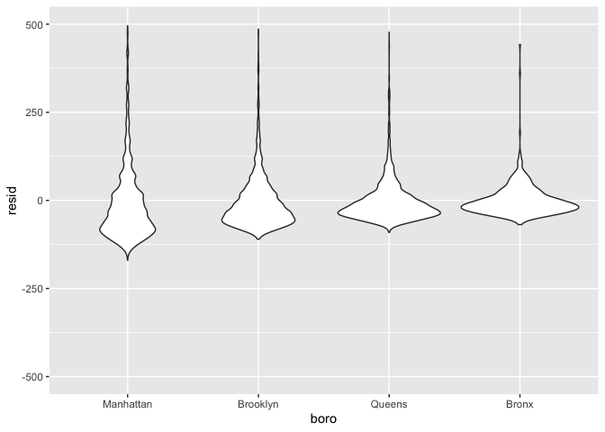
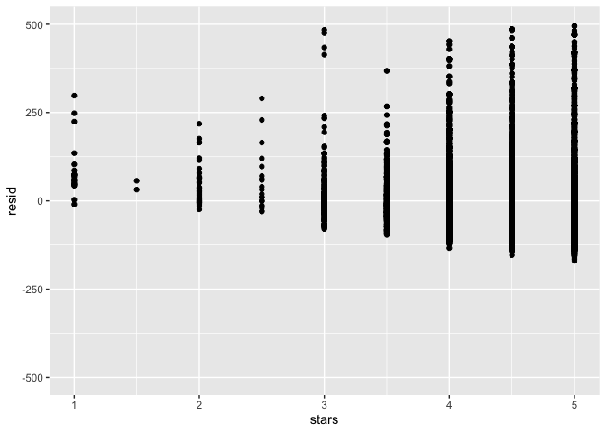
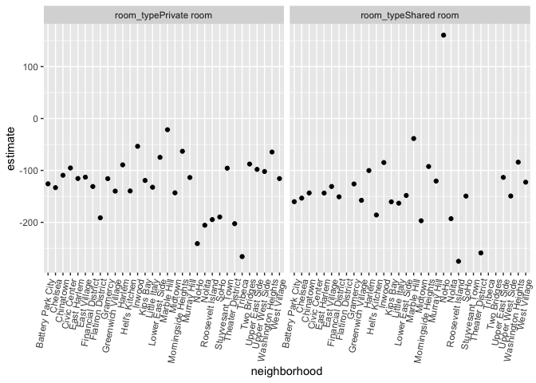

Linear\_models
================
Xin He
11/7/2019

## start

``` r
data("nyc_airbnb")

nyc_airbnb = 
  nyc_airbnb %>% 
  mutate(stars = review_scores_location / 2) %>% 
  rename(
    boro = neighbourhood_group,
    neighborhood = neighbourhood) %>% 
  filter(boro != "Staten Island") %>% 
  select(price, stars, boro, neighborhood, room_type)
```

## fit a first model

``` r
fit = lm(price ~ stars + boro, data = nyc_airbnb)
```

``` r
fit
```

    ## 
    ## Call:
    ## lm(formula = price ~ stars + boro, data = nyc_airbnb)
    ## 
    ## Coefficients:
    ##   (Intercept)          stars   boroBrooklyn  boroManhattan     boroQueens  
    ##        -70.41          31.99          40.50          90.25          13.21

``` r
summary(fit)
```

    ## 
    ## Call:
    ## lm(formula = price ~ stars + boro, data = nyc_airbnb)
    ## 
    ## Residuals:
    ##    Min     1Q Median     3Q    Max 
    ## -169.8  -64.0  -29.0   20.2 9870.0 
    ## 
    ## Coefficients:
    ##               Estimate Std. Error t value Pr(>|t|)    
    ## (Intercept)    -70.414     14.021  -5.022 5.14e-07 ***
    ## stars           31.990      2.527  12.657  < 2e-16 ***
    ## boroBrooklyn    40.500      8.559   4.732 2.23e-06 ***
    ## boroManhattan   90.254      8.567  10.534  < 2e-16 ***
    ## boroQueens      13.206      9.065   1.457    0.145    
    ## ---
    ## Signif. codes:  0 '***' 0.001 '**' 0.01 '*' 0.05 '.' 0.1 ' ' 1
    ## 
    ## Residual standard error: 181.5 on 30525 degrees of freedom
    ##   (9962 observations deleted due to missingness)
    ## Multiple R-squared:  0.03423,    Adjusted R-squared:  0.03411 
    ## F-statistic: 270.5 on 4 and 30525 DF,  p-value: < 2.2e-16

``` r
coef(fit)
```

    ##   (Intercept)         stars  boroBrooklyn boroManhattan    boroQueens 
    ##     -70.41446      31.98989      40.50030      90.25393      13.20617

``` r
summary(fit)$coef
```

    ##                Estimate Std. Error   t value     Pr(>|t|)
    ## (Intercept)   -70.41446  14.020697 -5.022180 5.137589e-07
    ## stars          31.98989   2.527500 12.656733 1.269392e-36
    ## boroBrooklyn   40.50030   8.558724  4.732049 2.232595e-06
    ## boroManhattan  90.25393   8.567490 10.534465 6.638618e-26
    ## boroQueens     13.20617   9.064879  1.456850 1.451682e-01

tidy the results

``` r
fit %>% 
  broom::tidy() %>% 
  mutate(term = str_replace(term, "boro", "Boro:")) %>% 
  knitr::kable(digit = 3)
```

| term           | estimate | std.error | statistic | p.value |
| :------------- | -------: | --------: | --------: | ------: |
| (Intercept)    | \-70.414 |    14.021 |   \-5.022 |   0.000 |
| stars          |   31.990 |     2.527 |    12.657 |   0.000 |
| Boro:Brooklyn  |   40.500 |     8.559 |     4.732 |   0.000 |
| Boro:Manhattan |   90.254 |     8.567 |    10.534 |   0.000 |
| Boro:Queens    |   13.206 |     9.065 |     1.457 |   0.145 |

``` r
fit %>% 
  broom::glance()
```

    ## # A tibble: 1 x 11
    ##   r.squared adj.r.squared sigma statistic   p.value    df  logLik    AIC
    ##       <dbl>         <dbl> <dbl>     <dbl>     <dbl> <int>   <dbl>  <dbl>
    ## 1    0.0342        0.0341  182.      271. 6.73e-229     5 -2.02e5 4.04e5
    ## # … with 3 more variables: BIC <dbl>, deviance <dbl>, df.residual <int>

## take a look at factors

``` r
nyc_airbnb = 
nyc_airbnb %>% 
  mutate(
    boro = fct_infreq(boro),
    room_type = fct_infreq(room_type)
  )
```

refit

``` r
fit = lm(price ~ stars + boro, data = nyc_airbnb)

fit %>%
  broom::tidy()
```

    ## # A tibble: 5 x 5
    ##   term         estimate std.error statistic   p.value
    ##   <chr>           <dbl>     <dbl>     <dbl>     <dbl>
    ## 1 (Intercept)      19.8     12.2       1.63 1.04e-  1
    ## 2 stars            32.0      2.53     12.7  1.27e- 36
    ## 3 boroBrooklyn    -49.8      2.23    -22.3  6.32e-109
    ## 4 boroQueens      -77.0      3.73    -20.7  2.58e- 94
    ## 5 boroBronx       -90.3      8.57    -10.5  6.64e- 26

## diagnostics

``` r
modelr::add_residuals(nyc_airbnb, fit) %>% 
  ggplot(aes(x = boro, y  = resid)) + 
  geom_violin() + 
  ylim(-500,  500)
```

    ## Warning: Removed 10202 rows containing non-finite values (stat_ydensity).

<!-- -->

``` r
modelr::add_residuals(nyc_airbnb, fit) %>% 
  ggplot(aes(x = stars, y  = resid)) + 
  geom_point() + 
  ylim(-500,  500)
```

    ## Warning: Removed 10202 rows containing missing values (geom_point).

<!-- -->

``` r
modelr::add_predictions(nyc_airbnb, fit)
```

    ## # A tibble: 40,492 x 6
    ##    price stars boro  neighborhood room_type        pred
    ##    <dbl> <dbl> <fct> <chr>        <fct>           <dbl>
    ##  1    99   5   Bronx City Island  Private room     89.5
    ##  2   200  NA   Bronx City Island  Private room     NA  
    ##  3   300  NA   Bronx City Island  Entire home/apt  NA  
    ##  4   125   5   Bronx City Island  Entire home/apt  89.5
    ##  5    69   5   Bronx City Island  Private room     89.5
    ##  6   125   5   Bronx City Island  Entire home/apt  89.5
    ##  7    85   5   Bronx City Island  Entire home/apt  89.5
    ##  8    39   4.5 Bronx Allerton     Private room     73.5
    ##  9    95   5   Bronx Allerton     Entire home/apt  89.5
    ## 10   125   4.5 Bronx Allerton     Entire home/apt  73.5
    ## # … with 40,482 more rows

## nesting

``` r
fit_interaction = lm(price ~ stars  * boro + room_type * boro, data = nyc_airbnb) %>% 
  broom::tidy()
```

``` r
nyc_airbnb %>% 
  filter(boro ==  "Brooklyn") %>% 
  lm(price ~ stars + room_type, data = .) %>%
  broom::tidy()
```

    ## # A tibble: 4 x 5
    ##   term                  estimate std.error statistic   p.value
    ##   <chr>                    <dbl>     <dbl>     <dbl>     <dbl>
    ## 1 (Intercept)               69.6     14.0       4.96 7.27e-  7
    ## 2 stars                     21.0      2.98      7.05 1.90e- 12
    ## 3 room_typePrivate room    -92.2      2.72    -34.0  6.40e-242
    ## 4 room_typeShared room    -106.       9.43    -11.2  4.15e- 29

map

``` r
nyc_airbnb %>% 
  nest(data  = -boro) %>% 
  mutate(
    models  = map(.x = data, ~lm(price ~ stars + room_type, data = .)),
    results  =  map(models, broom::tidy)
  ) %>% 
  select(-data) %>% 
  unnest(results)
```

    ## # A tibble: 16 x 7
    ##    boro     models term              estimate std.error statistic   p.value
    ##    <fct>    <list> <chr>                <dbl>     <dbl>     <dbl>     <dbl>
    ##  1 Bronx    <lm>   (Intercept)          90.1      15.2       5.94 5.73e-  9
    ##  2 Bronx    <lm>   stars                 4.45      3.35      1.33 1.85e-  1
    ##  3 Bronx    <lm>   room_typePrivate…   -52.9       3.57    -14.8  6.21e- 41
    ##  4 Bronx    <lm>   room_typeShared …   -70.5       8.36     -8.44 4.16e- 16
    ##  5 Queens   <lm>   (Intercept)          91.6      25.8       3.54 4.00e-  4
    ##  6 Queens   <lm>   stars                 9.65      5.45      1.77 7.65e-  2
    ##  7 Queens   <lm>   room_typePrivate…   -69.3       4.92    -14.1  1.48e- 43
    ##  8 Queens   <lm>   room_typeShared …   -95.0      11.3      -8.43 5.52e- 17
    ##  9 Brooklyn <lm>   (Intercept)          69.6      14.0       4.96 7.27e-  7
    ## 10 Brooklyn <lm>   stars                21.0       2.98      7.05 1.90e- 12
    ## 11 Brooklyn <lm>   room_typePrivate…   -92.2       2.72    -34.0  6.40e-242
    ## 12 Brooklyn <lm>   room_typeShared …  -106.        9.43    -11.2  4.15e- 29
    ## 13 Manhatt… <lm>   (Intercept)          95.7      22.2       4.31 1.62e-  5
    ## 14 Manhatt… <lm>   stars                27.1       4.59      5.91 3.45e-  9
    ## 15 Manhatt… <lm>   room_typePrivate…  -124.        3.46    -35.8  9.40e-270
    ## 16 Manhatt… <lm>   room_typeShared …  -154.       10.1     -15.3  2.47e- 52

nest neighborhhods

``` r
nyc_airbnb %>% 
  filter(boro == "Manhattan") %>% 
  nest(data  = -neighborhood) %>% 
  mutate(
    models  = map(.x = data, ~lm(price ~ stars + room_type, data = .x)),
    results  =  map(models, broom::tidy)
  ) %>% 
  select(neighborhood, results) %>% 
  unnest(results)
```

    ## # A tibble: 123 x 6
    ##    neighborhood     term              estimate std.error statistic  p.value
    ##    <chr>            <chr>                <dbl>     <dbl>     <dbl>    <dbl>
    ##  1 Battery Park Ci… (Intercept)         -119.      366.     -0.324 7.48e- 1
    ##  2 Battery Park Ci… stars                 74.0      74.2     0.997 3.27e- 1
    ##  3 Battery Park Ci… room_typePrivate…   -126.       27.6    -4.56  8.11e- 5
    ##  4 Battery Park Ci… room_typeShared …   -160.       56.3    -2.84  7.96e- 3
    ##  5 Chinatown        (Intercept)          337.       60.4     5.59  5.66e- 8
    ##  6 Chinatown        stars                -27.8      13.0    -2.14  3.34e- 2
    ##  7 Chinatown        room_typePrivate…   -109.       11.5    -9.52  1.03e-18
    ##  8 Chinatown        room_typeShared …   -143.       93.2    -1.54  1.25e- 1
    ##  9 Chelsea          (Intercept)          477.      135.      3.53  4.38e- 4
    ## 10 Chelsea          stars                -44.5      27.3    -1.63  1.04e- 1
    ## # … with 113 more rows

``` r
manhattan_nest_lm_res  = 
nyc_airbnb %>% 
  filter(boro == "Manhattan") %>% 
  nest(data  = -neighborhood) %>% 
  mutate(
    models  = map(.x = data, ~lm(price ~ stars + room_type, data = .x)),
    results  =  map(models, broom::tidy)
  ) %>% 
  select(neighborhood, results) %>% 
  unnest(results)
```

``` r
manhattan_nest_lm_res %>% 
  filter(str_detect(term, "room_type")) %>% 
  ggplot(aes(x = neighborhood, y = estimate)) + 
  geom_point() + 
  facet_wrap(~term) + 
  theme(axis.text.x = element_text(angle = 80, hjust = 1))
```

<!-- -->

``` r
nyc_airbnb %>% 
  filter(neighborhood == "NoHo", room_type  == "Shared room")
```

    ## # A tibble: 1 x 5
    ##   price stars boro      neighborhood room_type  
    ##   <dbl> <dbl> <fct>     <chr>        <fct>      
    ## 1   219     4 Manhattan NoHo         Shared room
