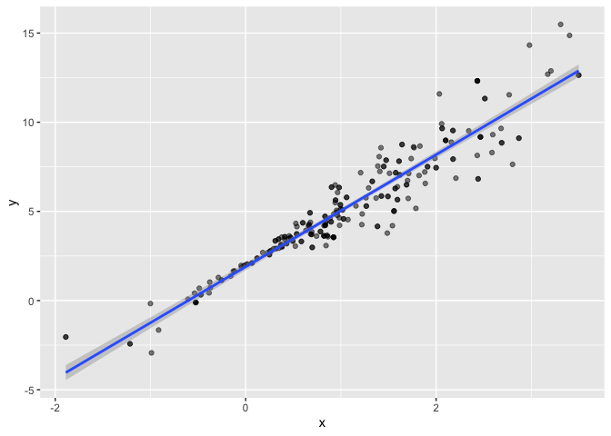
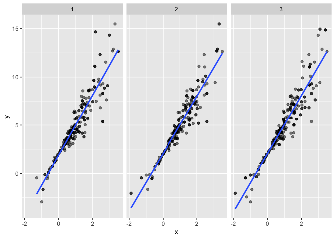
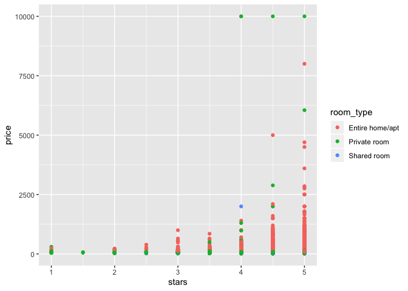

bootstrapping
================
Xin He
11/7/2019

## start

``` r
n_samp = 250

sim_df_const = 
  tibble(
    x = rnorm(n_samp, 1, 1),
    error = rnorm(n_samp, 0, 1),
    y = 2 + 3 * x + error
  )

sim_df_nonconst = sim_df_const %>% 
  mutate(
  error = error * .75 * x,
  y = 2 + 3 * x + error
)
```

``` r
sim_df = 
  bind_rows(const = sim_df_const, nonconst = sim_df_nonconst, .id = "data_source") 

sim_df %>% 
  ggplot(aes(x = x, y = y)) + 
  geom_point(alpha = .5) +
  stat_smooth(method = "lm") +
  facet_grid(~data_source) 
```

<!-- -->

``` r
lm(y ~ x, data = sim_df_const) %>% 
  broom::tidy() %>% 
  knitr::kable(digits = 3)
```

| term        | estimate | std.error | statistic | p.value |
| :---------- | -------: | --------: | --------: | ------: |
| (Intercept) |    1.977 |     0.098 |    20.157 |       0 |
| x           |    3.045 |     0.070 |    43.537 |       0 |

``` r
lm(y ~ x, data = sim_df_nonconst) %>% 
  broom::tidy() %>% 
  knitr::kable(digits = 3)
```

| term        | estimate | std.error | statistic | p.value |
| :---------- | -------: | --------: | --------: | ------: |
| (Intercept) |    1.934 |     0.105 |    18.456 |       0 |
| x           |    3.112 |     0.075 |    41.661 |       0 |

## how can’t bootstrap

``` r
sim_df_nonconst %>% 
  sample_frac(size = 1, replace = TRUE) %>% 
  arrange(x)
```

    ## # A tibble: 250 x 3
    ##         x  error       y
    ##     <dbl>  <dbl>   <dbl>
    ##  1 -1.89   1.62  -2.04  
    ##  2 -1.29   1.40  -0.454 
    ##  3 -0.989 -1.97  -2.93  
    ##  4 -0.989 -1.97  -2.93  
    ##  5 -0.914 -0.908 -1.65  
    ##  6 -0.914 -0.908 -1.65  
    ##  7 -0.914 -0.908 -1.65  
    ##  8 -0.733  0.447  0.248 
    ##  9 -0.733  0.447  0.248 
    ## 10 -0.606 -0.106  0.0774
    ## # … with 240 more rows

``` r
boot_sample = function(df) {
  sample_frac(df, replace = TRUE)
}
```

``` r
boot_sample(sim_df_nonconst) %>% 
  ggplot(aes(x = x, y = y)) + 
  geom_point(alpha = .5) +
  stat_smooth(method = "lm")
```

<!-- -->

``` r
boot_straps = 
  data_frame(
    strap_number = 1:1000,
    strap_sample = rerun(1000, boot_sample(sim_df_nonconst))
  )
```

    ## Warning: `data_frame()` is deprecated, use `tibble()`.
    ## This warning is displayed once per session.

``` r
boot_straps %>% 
  filter(strap_number %in% 1:2) %>% 
  mutate(strap_sample = map(strap_sample, ~arrange(.x, x))) %>% 
  pull(strap_sample)
```

    ## [[1]]
    ## # A tibble: 250 x 3
    ##         x  error       y
    ##     <dbl>  <dbl>   <dbl>
    ##  1 -1.29   1.40  -0.454 
    ##  2 -0.989 -1.97  -2.93  
    ##  3 -0.914 -0.908 -1.65  
    ##  4 -0.914 -0.908 -1.65  
    ##  5 -0.805  0.292 -0.123 
    ##  6 -0.805  0.292 -0.123 
    ##  7 -0.665 -0.544 -0.539 
    ##  8 -0.641 -0.416 -0.338 
    ##  9 -0.606 -0.106  0.0774
    ## 10 -0.606 -0.106  0.0774
    ## # … with 240 more rows
    ## 
    ## [[2]]
    ## # A tibble: 250 x 3
    ##         x  error      y
    ##     <dbl>  <dbl>  <dbl>
    ##  1 -1.89   1.62  -2.04 
    ##  2 -1.89   1.62  -2.04 
    ##  3 -1.29   1.40  -0.454
    ##  4 -1.29   1.40  -0.454
    ##  5 -1.00   0.832 -0.169
    ##  6 -0.914 -0.908 -1.65 
    ##  7 -0.805  0.292 -0.123
    ##  8 -0.665 -0.544 -0.539
    ##  9 -0.665 -0.544 -0.539
    ## 10 -0.665 -0.544 -0.539
    ## # … with 240 more rows

``` r
boot_straps %>% 
  filter(strap_number %in% 1:3) %>% 
  unnest(strap_sample) %>% 
  ggplot(aes(x = x, y = y)) + 
  geom_point(alpha = .5) +
  stat_smooth(method = "lm", se = FALSE) +
  facet_grid(~strap_number) 
```

<!-- -->

``` r
bootstrap_results = 
  boot_straps %>% 
  mutate(
    models = map(strap_sample, ~lm(y ~ x, data = .x) ),
    results = map(models, broom::tidy)) %>% 
  select(-strap_sample, -models) %>% 
  unnest() %>% 
  group_by(term) %>% 
  summarize(boot_se = sd(estimate))
```

    ## Warning: `cols` is now required.
    ## Please use `cols = c(results)`

``` r
bootstrap_results %>% 
  knitr::kable(digits = 3)
```

| term        | boot\_se |
| :---------- | -------: |
| (Intercept) |    0.075 |
| x           |    0.101 |

## try modelr

``` r
boot_straps = 
  sim_df_nonconst %>% 
  modelr::bootstrap(n = 1000)
```

``` r
sim_df_nonconst %>% 
  modelr::bootstrap(n = 1000) %>% 
  mutate(
    models = map(strap, ~lm(y ~ x, data = .x) ),
    results = map(models, broom::tidy)) %>% 
  select(-strap, -models) %>% 
  unnest(results) %>% 
  group_by(term) %>% 
  summarize(boot_se = sd(estimate))
```

    ## # A tibble: 2 x 2
    ##   term        boot_se
    ##   <chr>         <dbl>
    ## 1 (Intercept)  0.0793
    ## 2 x            0.104

``` r
sim_df_const %>% 
  modelr::bootstrap(n = 1000) %>% 
  mutate(models = map(strap, ~lm(y ~ x, data = .x) ),
         results = map(models, broom::tidy)) %>% 
  select(-strap, -models) %>% 
  unnest(results) %>% 
  group_by(term) %>% 
  summarize(boot_se = sd(estimate))
```

    ## # A tibble: 2 x 2
    ##   term        boot_se
    ##   <chr>         <dbl>
    ## 1 (Intercept)  0.101 
    ## 2 x            0.0735

## revisit airbnb

``` r
data("nyc_airbnb")

nyc_airbnb = 
  nyc_airbnb %>% 
  mutate(stars = review_scores_location / 2) %>% 
  rename(
    boro = neighbourhood_group,
    neighborhood = neighbourhood) %>% 
  filter(boro != "Staten Island") %>% 
  select(price, stars, boro, neighborhood, room_type)
```

``` r
nyc_airbnb %>% 
  ggplot(aes(x = stars, y = price, color = room_type)) + 
  geom_point() 
```

    ## Warning: Removed 9962 rows containing missing values (geom_point).

<!-- -->

ew-use tge stuff

``` r
airbnb_results = 
nyc_airbnb %>% 
  filter(boro == "Manhattan") %>% 
  modelr::bootstrap(n = 1000) %>% 
  mutate(
    models = map(strap, ~ lm(price ~ stars + room_type, data = .x)),
    results = map(models, broom::tidy)) %>% 
  select(results) %>% 
  unnest(results) %>% 
  filter(term == "stars") %>% 
  ggplot(aes(x = estimate)) + geom_density()
```

a plot of star distribution
